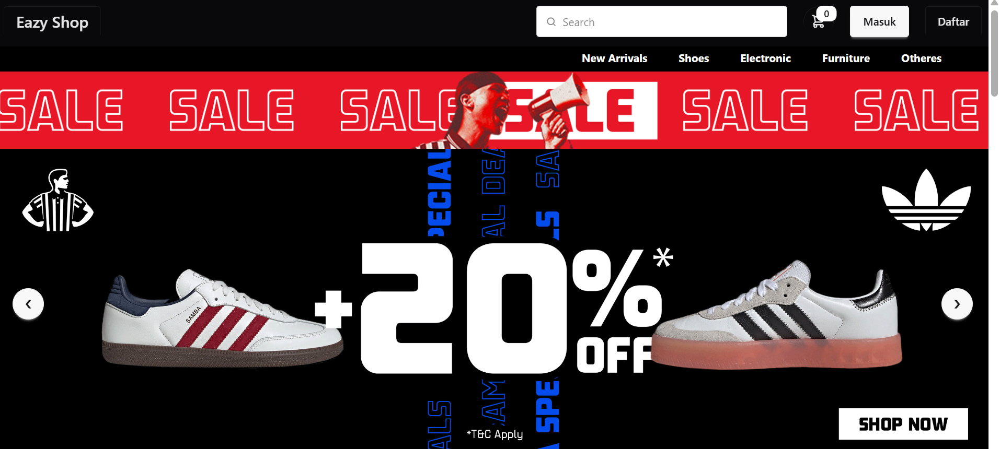
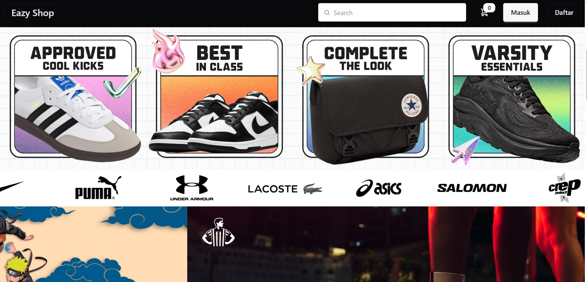
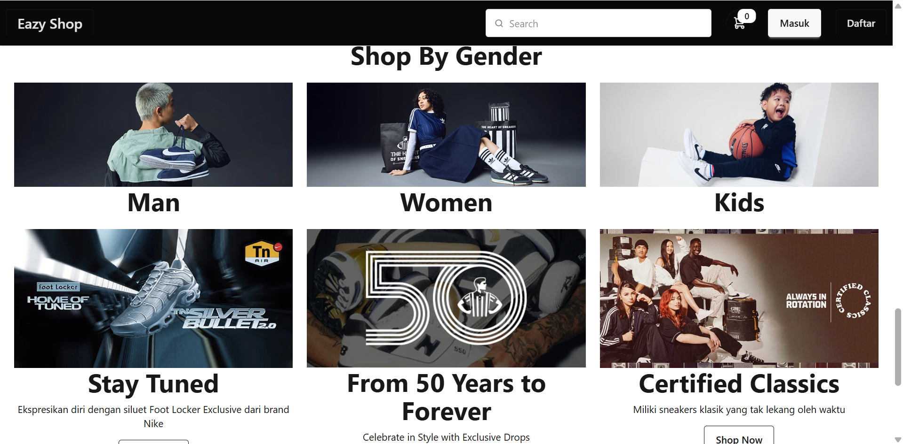
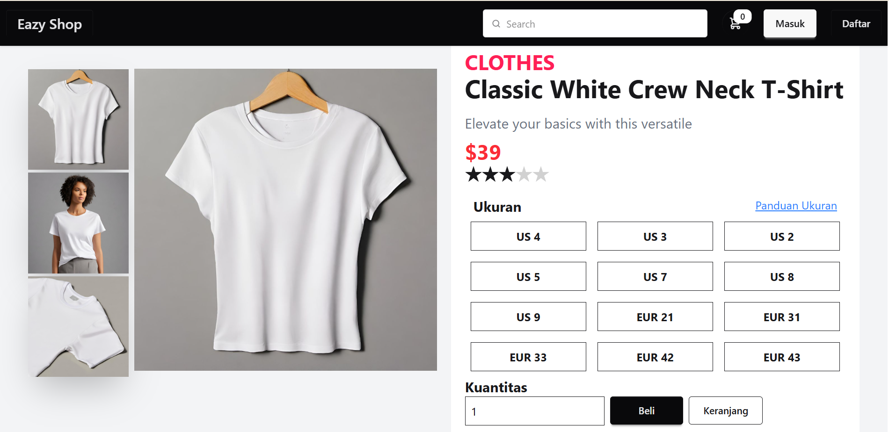
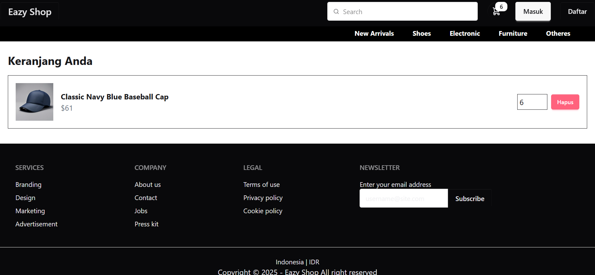

# 🛒 Online Fashion Store - React E-commerce UI

Selamat datang di **Online Fashion Store**, sebuah antarmuka toko online modern yang dibangun menggunakan **React**, **Vite**, dan **Tailwind CSS**. Proyek ini dirancang untuk menampilkan katalog produk fashion secara visual menarik, cepat, dan responsif.

🔗 **Live Demo**: [https://store-sage-one.vercel.app/](https://store-sage-one.vercel.app/)

## ✨ Fitur Utama

- 📸 Galeri produk dengan gambar high-quality
- ⚡ Pengembangan cepat dengan Vite
- 🎨 Desain responsive dengan Tailwind CSS
- 🧩 Komponen modular dan reusable
- 🚀 Dideploy otomatis di Vercel

## 🧑‍💻 Tech Stack

- [React](https://reactjs.org/)
- [Vite](https://vitejs.dev/)
- [Tailwind CSS](https://tailwindcss.com/)
- [Vercel](https://vercel.com/)

## 📂 Struktur Folder

```
├── public/
│   └── preview.png            # Gambar preview (opsional)
├── src/
│   ├── assets/                # Gambar produk & aset statis
│   ├── components/            # Komponen halaman seperti CardPage.jsx
│   ├── App.jsx                # Root komponen utama
│   ├── main.jsx               # Entry point aplikasi React
│   └── index.css              # Global styles & Tailwind
├── .gitignore
├── index.html
├── package.json
├── postcss.config.js
├── tailwind.config.js
├── vite.config.js
└── README.md
```

## 🚀 Cara Menjalankan Secara Lokal

### 1. Clone Repository

```bash
git clone https://github.com/your-username/nama-repo-anda.git
cd nama-repo-anda
```

### 2. Install Dependencies

```bash
npm install
```

### 3. Jalankan Aplikasi

```bash
npm run dev
```

### 4. Build untuk Produksi

```bash
npm run build
```

## 🔧 Cara Deploy (Opsional)

Proyek ini bisa langsung dideploy di [Vercel](https://vercel.com/):

1. Push ke GitHub
2. Login ke Vercel, import project dari GitHub
3. Pilih preset **Vite**
4. Klik **Deploy**

## 📸 Preview

```md





```

## 👨‍🎨 Developer

- 🧑‍💻 Nama: **Muhamad Husnul**
- 📍 Lokasi: Depok, Indonesia
- 📷 Instagram: [@muhamadhusnul_22](https://instagram.com/muhamadhusnul_22)

## 📜 Lisensi

MIT License. Silakan gunakan, modifikasi, dan distribusikan.

---
